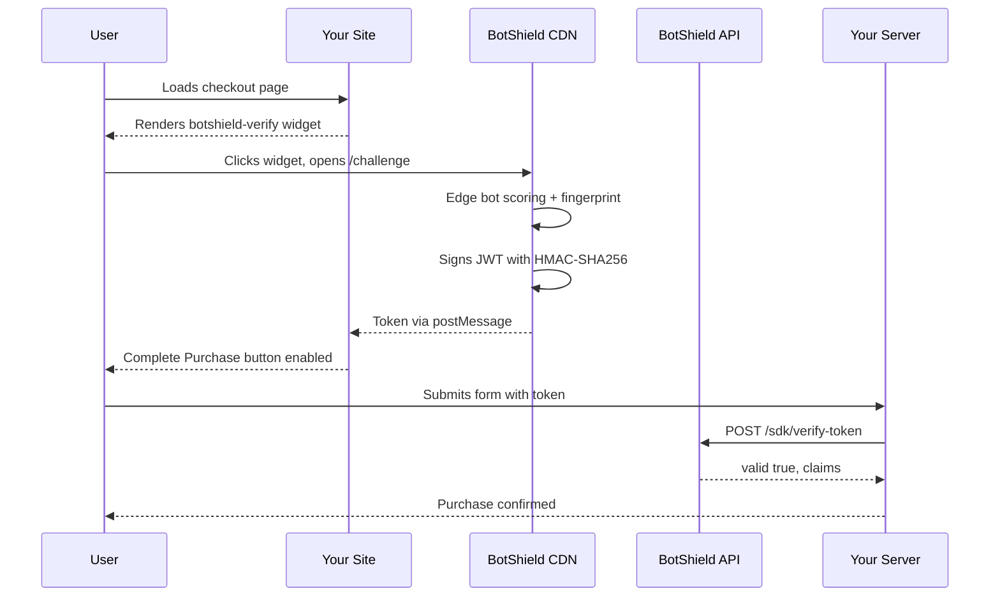

# BotShield Demo — Ticketz Checkout

A demo checkout page showing how to integrate the [BotShield](https://botshield.ai) client SDK into a Cloudflare Worker site. The page simulates a concert ticket purchase gated behind human presence verification.

**Live demo:** [demo.botshield.ai](https://demo.botshield.ai)

## How It Works



No secrets on your site. The `pk_*` site key is public. Token signing happens on BotShield's infrastructure. Your server validates tokens via the [BotShield API](https://docs.botshield.ai).

## Quick Start

### 1. Clone and install

```bash
git clone https://github.com/Bot-Shield/botshield-demo.git
cd botshield-demo
npm install
```

### 2. Add your site key

Edit `src/worker.ts` and replace the site key:

```html
<botshield-verify site-key="pk_test_YOUR_KEY_HERE" theme="dark">
```

Get a site key from the [BotShield Console](https://console.botshield.ai) under **Settings → Site Keys**.

> **Important:** Your deployment domain must be added as a **trusted origin** on your site key. In the BotShield Console, go to **Settings → Site Keys**, select your key, and add your domain (e.g. `https://your-domain.com`) to the **Allowed Origins** list. Requests from unregistered origins will be rejected.

### 3. Run locally

```bash
npx wrangler dev
```

Open [http://localhost:8787](http://localhost:8787).

### 4. Deploy to Cloudflare

```bash
npx wrangler deploy
```

To use a custom domain, update `wrangler.jsonc`:

```jsonc
{
  "routes": [
    { "pattern": "your-domain.com", "custom_domain": true }
  ]
}
```

After deploying, add `https://your-domain.com` to your site key's **Allowed Origins** in the [BotShield Console](https://console.botshield.ai) — otherwise the widget will fail origin validation.

## Customization

This is a single-file Worker (`src/worker.ts`) that returns HTML. Customize it however you want:

- **Branding** — change colors, logo, product details
- **Theme** — set `theme="light"`, `theme="dark"`, or `theme="auto"` on the widget
- **Button gating** — the "Complete Purchase" button is disabled until verification succeeds:

```javascript
document.addEventListener('botshield:success', (e) => {
  const token = e.detail.token; // signed JWT
  buyButton.disabled = false;
});
```

- **Server-side validation** — send the token to your backend and call:

```bash
curl -X POST https://api.botshield.ai/operations/sdk/verify-token \
  -H "Content-Type: application/json" \
  -d '{"token": "eyJhbG..."}'
```

Response:
```json
{
  "valid": true,
  "claims": {
    "botshield_user_id": "abc-123",
    "verified": true,
    "auth_mode": "private",
    "organization_id": "org_...",
    "expires_at": 1710700000
  }
}
```

## Widget Reference

```html
<!-- Load the SDK -->
<script src="https://cdn.botshield.ai/sdk.js"></script>

<!-- Place the widget -->
<botshield-verify
  site-key="pk_test_..."
  theme="dark"
  onsuccess="handleVerified"
  onfailure="handleFailed"
></botshield-verify>

<script>
  function handleVerified(detail) {
    console.log('Token:', detail.token);
    console.log('Score:', detail.score);
  }

  function handleFailed(detail) {
    console.log('Reason:', detail.reason);
  }
</script>
```

| Attribute | Values | Default | Description |
|-----------|--------|---------|-------------|
| `site-key` | `pk_test_*`, `pk_live_*` | — | Your BotShield site key (required) |
| `theme` | `light`, `dark`, `auto` | `auto` | Widget color scheme |
| `mode` | `session`, `always` | `session` | Verification frequency |
| `onsuccess` | function name | — | Called with `{ token, score }` on verification |
| `onfailure` | function name | — | Called with `{ reason, score }` on failure |

## Events

The widget dispatches Custom Events that bubble through the DOM:

| Event | Detail | When |
|-------|--------|------|
| `botshield:success` | `{ token, score }` | User verified |
| `botshield:failure` | `{ reason, score }` | Verification failed or bot detected |
| `botshield:challenge` | `{ reason, verification_url }` | Active verification needed (high-risk score) |
| `botshield:reset` | `{}` | Widget reset to idle |

## Links

- [BotShield Documentation](https://docs.botshield.ai)
- [API Reference](https://docs.botshield.ai/api-reference/overview)
- [Request Developer Access](https://botshield.ai/pricing)

## License

MIT
