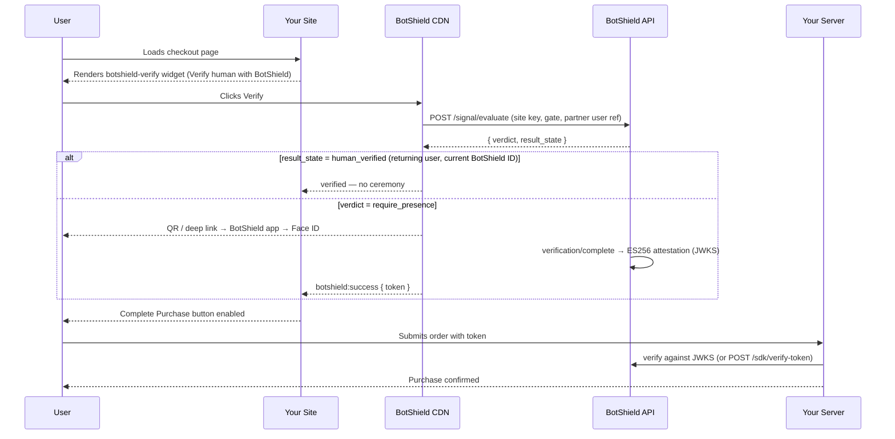

# BotShield Demo — Ticketz Checkout

A demo checkout page showing how to integrate the [BotShield](https://botshield.ai) client SDK into a Cloudflare Worker site. The page simulates a concert ticket purchase gated behind human presence verification.

**Live demo:** [demo.botshield.ai](https://demo.botshield.ai)

## How It Works


```mermaid
sequenceDiagram
    participant User
    participant Site as Your Site
    participant CDN as BotShield CDN
    participant API as BotShield API
    participant Server as Your Server

    User->>Site: Loads checkout page
    Site-->>User: Renders botshield-verify widget (Verify human with BotShield)

    User->>CDN: Clicks Verify
    CDN->>API: POST /signal/evaluate (site key, gate, partner user ref)
    API-->>CDN: { verdict, result_state }
    alt result_state = human_verified (returning user, current BotShield ID)
        CDN-->>Site: verified — no ceremony
    else verdict = require_presence
        CDN-->>User: QR / deep link → BotShield app → Face ID
        API->>API: verification/complete → ES256 attestation (JWKS)
        CDN-->>Site: botshield:success { token }
    end

    Site-->>User: Complete Purchase button enabled

    User->>Server: Submits order with token
    Server->>API: verify against JWKS (or POST /sdk/verify-token)
    Server-->>User: Purchase confirmed
```

No secrets on your site. The `pk_*` site key is public. The attestation is an **ES256 JWT** signed on BotShield's infrastructure and verifiable against BotShield's public **JWKS** (`https://api.botshield.ai/.well-known/jwks.json`) — your server can validate it locally, or call the [BotShield API](https://docs.botshield.ai). Your site never learns *who* the person is — only that a real human is present (**Census two-result-state contract**: `human_verified` | `unavailable`).

## Quick Start

### 1. Clone and install

```bash
git clone https://github.com/Bot-Shield/botshield-demo.git
cd botshield-demo
npm install
```

### 2. Add your site key

Edit `src/worker.ts` and replace the site key:

```html
<botshield-verify site-key="pk_test_YOUR_KEY_HERE" theme="dark">
```

Get a site key from the [BotShield Console](https://console.botshield.ai) under **Settings → Site Keys**.

> **Important:** Your deployment domain must be added as a **trusted origin** on your site key. In the BotShield Console, go to **Settings → Site Keys**, select your key, and add your domain (e.g. `https://your-domain.com`) to the **Allowed Origins** list. Requests from unregistered origins will be rejected.

### 3. Run locally

```bash
npx wrangler dev
```

Open [http://localhost:8787](http://localhost:8787).

### 4. Deploy to Cloudflare

```bash
npx wrangler deploy
```

To use a custom domain, update `wrangler.jsonc`:

```jsonc
{
  "routes": [
    { "pattern": "your-domain.com", "custom_domain": true }
  ]
}
```

After deploying, add `https://your-domain.com` to your site key's **Allowed Origins** in the [BotShield Console](https://console.botshield.ai) — otherwise the widget will fail origin validation.

## Customization

This is a single-file Worker (`src/worker.ts`) that returns HTML. Customize it however you want:

- **Branding** — change colors, logo, product details
- **Theme** — set `theme="light"`, `theme="dark"`, or `theme="auto"` on the widget
- **Button gating** — the widget owns a verified-gated checkout button (`checkout-label`) and fires `botshield:checkout` only from its resolved state; or gate your own button on `botshield:success`:

```javascript
document.addEventListener('botshield:success', (e) => {
  const { token, request_id, via } = e.detail; // token = ES256 attestation JWT
  buyButton.disabled = false;
});
```

- **Returning users (BotShield ID continuity)** — pass your own user id as `platform-user-ref`. The first verification links it to the person's BotShield ID (`link-on-verify`, default on); on later visits `/signal/evaluate` returns `result_state: "human_verified"` directly and the widget resolves with no QR and no Face ID.

- **Server-side validation** — the attestation is an ES256 JWT (`kid` in the header). Verify it locally against BotShield's JWKS — `https://api.botshield.ai/.well-known/jwks.json` — with any standard JWT library, or send it to BotShield:

```bash
curl -X POST https://api.botshield.ai/operations/sdk/verify-token \
  -H "Content-Type: application/json" \
  -d '{"token": "eyJhbG..."}'
```

The claims carry `verified: true`, the `request_id`, the organization, and expiry (attestations are short-lived and single-use per request) — and **no identity**: BotShield never returns who the person is.

## Widget Reference

```html
<!-- Load the SDK -->
<script src="https://cdn.botshield.ai/sdk.js"></script>

<!-- Place the widget -->
<botshield-verify
  site-key="pk_test_..."
  scope="ticket_purchase"
  theme="dark"
  platform-user-ref="your-user-id"
  link-on-verify="true"
  checkout-label="Complete Purchase"
  onsuccess="handleVerified"
  onfailure="handleFailed"
></botshield-verify>

<script>
  function handleVerified(detail) {
    console.log('Token:', detail.token, 'via:', detail.via);
  }

  function handleFailed(detail) {
    console.log('Failed:', detail.reason);
  }
</script>
```

| Attribute | Values | Default | Description |
|-----------|--------|---------|-------------|
| `site-key` | `pk_test_*`, `pk_live_*` | — | Your BotShield site key (required) |
| `scope` | gate name | — | The **gate** this action moment runs (create gates in the Console under BotShield Census) |
| `theme` | `light`, `dark`, `auto` | `auto` | Widget color scheme |
| `mode` | `private`, `linked-account` | `private` | Anonymous verification vs. link a known account |
| `platform-user-ref` | your user id | — | Enables BotShield ID continuity for returning users (sent to BotShield as `partner_user_ref`; hashed at rest) |
| `link-on-verify` | `true`, `false` | `true` | Write the user↔BotShield ID linkage after a successful verification |
| `scan-mode` | `modal` | `modal` | On desktop, the QR hand-off renders as an on-page modal |
| `checkout-label` | text | — | Label for the widget-owned, verified-gated checkout button |
| `onsuccess` / `onfailure` | function name | — | Callbacks mirroring the events below |

## Events

The widget dispatches Custom Events that bubble through the DOM:

| Event | Detail | When |
|-------|--------|------|
| `botshield:multipass-status` | `{ event_id, request_id, verdict, result_state }` | The pre-check answer from `/signal/evaluate`. **Gate on `result_state`** (`human_verified` \| `unavailable`); `verdict` (`pass` \| `require_presence`) is only the widget's flow signal. *(Event name kept for compatibility.)* |
| `botshield:success` | `{ token, request_id, via }` | A real human is verified — `token` is the ES256 attestation |
| `botshield:failure` | `{ reason }` | Verification failed or was declined |
| `botshield:challenge` | `{ request_id, web_url, deep_link }` | A verification ceremony was started (QR / deep link) |
| `botshield:checkout` | `{ request_id }` | The widget-owned checkout button was clicked from a verified state |
| `botshield:reset` | `{}` | Widget reset to idle |

## Links

- [BotShield Documentation](https://docs.botshield.ai)
- [API Reference](https://docs.botshield.ai/api-reference/overview)
- [Request Developer Access](https://botshield.ai/pricing)

## License

MIT
